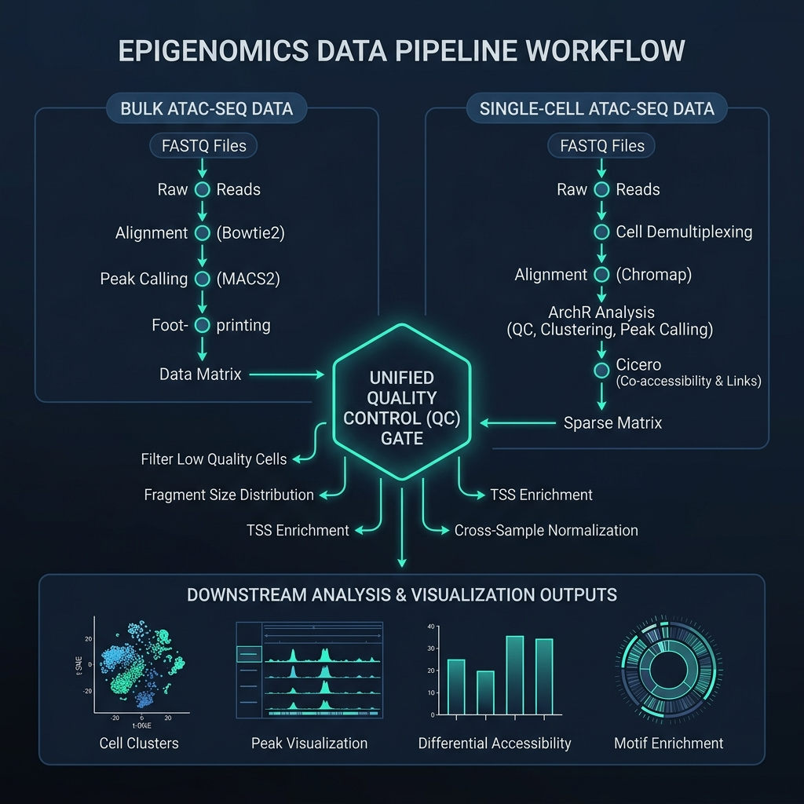

# BDB-Genomics ATAC-seq Pipeline

A production-grade Snakemake framework for end-to-end ATAC-seq analysis. Supports both bulk and single-cell modalities from a single codebase, with built-in quality control gating that prevents low-quality samples from consuming downstream compute.

[](https://github.com/BDB-Genomics/atacseq-pipeline/actions/workflows/lint.yml)
[](https://snakemake.github.io)
[](LICENSE)



---

## Table of Contents

1. [Design Principles](#design-principles)
2. [Installation](#installation)
3. [Configuration](#configuration)
4. [Running the Pipeline](#running-the-pipeline)
5. [Execution Profiles](#execution-profiles)
6. [Bulk and Single-Cell Modes](#bulk-and-single-cell-modes)
7. [Pipeline Stages and Outputs](#pipeline-stages-and-outputs)
8. [Quality Control Gate](#quality-control-gate)
9. [Low-Resource Execution](#low-resource-execution)
10. [Continuous Integration](#continuous-integration)
11. [Extending the Pipeline](#extending-the-pipeline)
12. [Repository Structure](#repository-structure)
13. [Citation](#citation)

---

## Design Principles

The framework is built on four architectural decisions that distinguish it from typical bioinformatics pipelines:

**Pre-flight validation.** Before Snakemake builds the DAG, a validation script (`rules/scripts/validate_config.py`) parses `config.yaml` and the sample sheet. It checks that every referenced file exists, that sample names contain only safe characters, and that every rule block has the required keys. If validation fails, the pipeline exits immediately with a categorized error report. No compute is wasted.

**Quality control gating.** After alignment metrics are collected, a QC gate evaluates each sample against user-defined thresholds (FRiP, TSS enrichment, mapping rate, duplication rate). Samples that fail are blocked from expensive downstream steps like peak calling, footprinting, and differential analysis.

**Config-driven architecture.** Every tool parameter, file path, resource limit, and biological threshold lives in `config.yaml`. The Snakemake rules are stateless wrappers that read from this file at runtime. Changing a reference genome or adjusting memory limits requires editing one file. The change propagates to all 47 rules automatically.

**Resilient fallbacks.** Downstream scripts (DESeq2, chromVAR, ChIPseeker, TOBIAS, deepTools) catch statistical failures from low-coverage or zero-peak samples. Instead of crashing the DAG, they write placeholder outputs with valid headers and exit cleanly. The pipeline completes, and the MultiQC report flags which samples produced placeholder results.

---

## Installation

The pipeline requires Snakemake 8.0 or later and Conda (or Mamba) for per-rule environment isolation.

```bash
# Create the runner environment
conda create -n atacseq snakemake>=8.0 -c conda-forge -c bioconda
conda activate atacseq
```

Each rule declares its own Conda environment under `rules/envs/`. Snakemake creates these automatically on first run. No manual installation of individual tools is needed.

---

## Configuration

Two files control the pipeline. Everything else is derived from them.

### 1. Sample sheet (`data/fastp/samples.tsv`)

A tab-separated file with one row per sample:

```
sample    fastq_r1                              fastq_r2                              replicate    condition
patient1  data/fastq/patient1_R1.fastq.gz       data/fastq/patient1_R2.fastq.gz       1            treated
patient2  data/fastq/patient2_R1.fastq.gz       data/fastq/patient2_R2.fastq.gz       2            treated
ctrl1     data/fastq/ctrl1_R1.fastq.gz          data/fastq/ctrl1_R2.fastq.gz          1            control
ctrl2     data/fastq/ctrl2_R1.fastq.gz          data/fastq/ctrl2_R2.fastq.gz          2            control
```

The `replicate` and `condition` columns drive IDR analysis (replicate concordance) and DESeq2 (differential accessibility between conditions).

### 2. Pipeline configuration (`config.yaml`)

The file is organized into a global block and per-tool blocks. Here is a representative excerpt:

```yaml
# --- Global references (YAML anchors propagate these to all tools) ---
global:
  mode: "bulk"                                      # "bulk" or "scatac"
  samples: "data/fastp/samples.tsv"
  references:
    genome_fa: &GENOME_FA "data/reference/genome.fa"
    bowtie2_index: &BOWTIE2_INDEX "data/reference/index/genome"
    blacklist: &BLACKLIST "data/reference/ENCODE_blacklist.bed"
    annotation_gtf: &ANNOTATION_GTF "data/reference/annotation.gtf"
    motif_db: &MOTIF_DB "data/motifs/jaspar_vertebrates.meme"

# --- Per-tool block (every tool follows this schema) ---
bowtie2:
  input: "results/preprocessing/fastp"
  output: "results/alignment/bowtie2"
  params:
    index: *BOWTIE2_INDEX               # resolved from the anchor above
    sensitive: "--very-sensitive"
  threads: 8
  resources:
    mem_mb: 16000
    time: 240                           # minutes

# --- QC gate thresholds ---
qc_gate:
  params:
    min_frip: 0.2
    min_tss_enr: 7.0
    min_mapping_rate: 80.0
    max_duplicate_rate: 20.0
```

YAML anchors (`&GENOME_FA`, `*GENOME_FA`) ensure that a reference path defined once propagates everywhere. If you switch from hg38 to mm10, change the path in the `global.references` block and every downstream tool inherits it.

---

## Running the Pipeline

### Standard execution

```bash
snakemake --use-conda --cores 8
```

This runs the full bulk ATAC-seq workflow: preprocessing, alignment, post-alignment filtering, QC metrics, QC gating, peak calling, footprinting, differential analysis, and reporting.

### Dry run (validate without executing)

```bash
snakemake -n --use-conda --cores 8
```

Prints the full DAG of jobs without running them. Useful for verifying that configuration changes produce the expected execution plan.

### Resume after failure

```bash
snakemake --use-conda --cores 8 --rerun-incomplete
```

Snakemake tracks completed outputs. Only incomplete or failed rules re-execute.

---

## Execution Profiles

Profiles bundle runtime flags into reusable configurations. Each profile is a directory under `profile/` containing a `config.yaml`.

| Profile | Use case | Parallel jobs | Default memory | Command |
| :--- | :--- | ---: | ---: | :--- |
| `local` | Workstation (16 GB RAM, 8+ cores) | 8 | 4 GB | `snakemake --profile profile/local` |
| `low_resource` | Laptop (4-8 GB RAM, 2-4 cores) | 2 | 2 GB | `snakemake --profile profile/low_resource` |
| `slurm` | HPC cluster | 100 | 4 GB | `snakemake --profile profile/slurm` |
| `test` | CI/CD validation | 4 | 2 GB | `snakemake --profile profile/test` |

Example: running on a SLURM cluster after editing the partition and account:

```bash
# 1. Edit profile/slurm/config.yaml:
#    slurm_partition: "your_partition"
#    slurm_account: "your_billing_account"

# 2. Submit
snakemake --profile profile/slurm
```

The `low_resource` profile caps every rule individually. For instance, Bowtie2 alignment is limited to 4 GB and 2 threads, MACS2 peak calling to 4 GB and 2 threads, and indexing steps to 1 GB and 1 thread. The full per-rule breakdown is in `profile/low_resource/config.yaml`.

---

## Bulk and Single-Cell Modes

The pipeline supports two ATAC-seq modalities from a single codebase. The mode is set either through `config.yaml` or an environment variable:

```bash
# Bulk ATAC-seq (default)
snakemake --use-conda --cores 8

# Single-cell ATAC-seq
ATAC_MODE=scatac snakemake --use-conda --cores 8

# Or set permanently in config.yaml:
# global:
#   mode: "scatac"
```

The mode switch changes which rule files are loaded. Everything downstream of alignment diverges:

| Stage | Bulk mode | Single-cell mode |
| :--- | :--- | :--- |
| Alignment | Bowtie2 (`--very-sensitive`) | Chromap (`--preset atac`) |
| Post-alignment | Samtools sort, fixmate, markdup, MAPQ/flag filter, Tn5 shift | ArchR Arrow files, doublet filtering |
| Peak calling | MACS2 (narrowPeak) + IDR replicate concordance | ArchR iterative clustering + marker peaks |
| Co-accessibility | -- | Cicero (CCANs, co-accessibility networks) |
| Differential | DESeq2 (condition-level) | ArchR per-cluster marker genes |
| Footprinting | HINT-ATAC + TOBIAS BINDetect | chromVAR motif accessibility deviations |
| QC thresholds | TSS enrichment, FRiP, mapping rate, duplication | TSS enrichment, fragments/cell, doublet rate |

---

## Pipeline Stages and Outputs

The bulk mode DAG contains 119 jobs (for 3 samples). All outputs are written under `results/`.

### Stage 1: Preprocessing

| Tool | Output | Purpose |
| :--- | :--- | :--- |
| fastp | `results/preprocessing/fastp/{sample}_R1_trimmed.fastq.gz` | Adapter trimming, quality filtering |
| FastQC | `results/preprocessing/fastqc/{sample}_R1_trimmed_fastqc.html` | Per-base quality visualization |

### Stage 2: Alignment

| Tool | Output | Purpose |
| :--- | :--- | :--- |
| Bowtie2 | `results/alignment/bowtie2/{sample}.bam` | Paired-end alignment to reference genome |

### Stage 3: Post-alignment filtering

Applied sequentially per sample:

1. **Samtools sort** -- coordinate-sort the BAM
2. **Mitochondrial read quantification** -- count reads mapping to chrM/chrMT
3. **Samtools fixmate + markdup** -- flag and mark PCR duplicates
4. **Mitochondrial read removal** -- exclude chrM reads from downstream analysis
5. **MAPQ and flag filtering** -- remove unmapped, secondary, and low-quality alignments (MAPQ < 30)
6. **Blacklist removal** -- exclude ENCODE-defined problematic regions
7. **Tn5 shift** -- apply +4/-5 bp offset to correct for Tn5 transposase insertion bias

### Stage 4: Quality metrics

| Tool | Metric |
| :--- | :--- |
| Samtools stats | Post-filtering alignment statistics |
| Picard CollectAlignmentSummaryMetrics | Mapping rate, mismatch rate |
| Picard CollectInsertSizeMetrics | Fragment size distribution |
| Preseq | Library complexity extrapolation |
| Qualimap BamQC | Genome coverage, GC bias |
| TSS enrichment (R script) | Signal-to-noise at transcription start sites |
| Cross-correlation (phantompeakqualtools) | NSC and RSC scores (ENCODE standard) |

### Stage 5: QC gate

Each sample is evaluated against four thresholds. Samples that fail are excluded from peak calling and all downstream analysis. See [Quality Control Gate](#quality-control-gate).

### Stage 6: Peak calling and downstream analysis

| Tool | Output |
| :--- | :--- |
| MACS2 | Per-sample narrowPeak files |
| Blacklist filter | Filtered peak BED files |
| FRiP calculation | Fraction of reads in peaks per sample |
| IDR | Replicate-concordant peaks per condition |
| Consensus peaks | Merged peak set (peaks present in >= 2 samples) |
| ChIPseeker (R) | Genomic feature annotation of peaks |
| HOMER | De novo and known motif enrichment |
| DESeq2 (R) | Differentially accessible regions, volcano/MA/PCA plots |
| HINT-ATAC (RGT) | Per-base transcription factor footprint positions |
| TOBIAS | Bias-corrected footprint scores + BINDetect differential binding |
| chromVAR (R) | Bias-corrected motif accessibility deviation scores |

### Stage 7: Visualization

| Output | Description |
| :--- | :--- |
| BigWig tracks | Genome browser signal tracks |
| CPM-normalized coverage | Cross-sample comparable signal |
| TSS heatmaps | Signal enrichment around transcription start sites |
| Correlation matrix | Sample-to-sample Pearson correlation heatmap |

### Stage 8: Reporting

| Output | Description |
| :--- | :--- |
| MultiQC HTML report | Aggregates all QC metrics into a single interactive report |
| Benchmark summary TSV | Runtime, peak memory, and CPU usage for every rule execution |

---

## Quality Control Gate

The QC gate sits between metric collection (Stage 4) and peak calling (Stage 6). It evaluates four metrics per sample:

| Metric | Default threshold | Interpretation |
| :--- | :--- | :--- |
| FRiP (Fraction of Reads in Peaks) | >= 0.2 | Measures biological signal enrichment |
| TSS enrichment score | >= 7.0 | Signal-to-noise at promoter regions |
| Genome mapping rate | >= 80.0% | Alignment quality |
| Duplicate rate | <= 20.0% | Library complexity |

A sample that fails any threshold is written to `results/qc_gate/{sample}_qc_pass.txt` with a `FAILED` status. The pipeline continues to run for all remaining samples, but failed samples do not enter peak calling, footprinting, or differential analysis.

To adjust thresholds for your experiment:

```yaml
# In config.yaml
qc_gate:
  params:
    min_frip: 0.15           # relax for low-depth pilot experiments
    min_tss_enr: 5.0         # relax for non-standard organisms
    min_mapping_rate: 70.0
    max_duplicate_rate: 30.0
```

For CI/CD testing with synthetic data, the test profile (`profile/test/config_test.yaml`) overrides all thresholds to fully permissive values so the pipeline can validate execution logic on minimal inputs:

```yaml
# profile/test/config_test.yaml
qc_gate:
  params:
    min_frip: 0.0
    min_tss_enr: 0.0
    min_mapping_rate: 0.0
    max_duplicate_rate: 100.0
```

---

## Low-Resource Execution

### Using the low-resource profile

The `low_resource` profile caps memory and thread allocations for every rule. It runs a maximum of 2 parallel jobs:

```bash
snakemake --profile profile/low_resource
```

Representative per-rule caps:

| Rule | Memory cap | Threads |
| :--- | ---: | ---: |
| Bowtie2 alignment | 4 GB | 2 |
| Samtools markdup | 4 GB | 2 |
| MACS2 peak calling | 4 GB | 2 |
| TOBIAS ATACorrect | 4 GB | 2 |
| DESeq2 | 4 GB | 2 |
| Samtools index | 1 GB | 1 |
| MultiQC | 2 GB | 1 |

### Sequential batching for very limited hardware

For machines with less than 4 GB of RAM, the batched runner processes samples one at a time:

```bash
python3 rules/scripts/run_batched.py --batch-size 1 --cores 2 --memory 4000
```

The script reads the sample sheet, partitions samples into batches of the given size, and runs Snakemake once per batch. Because all batches write to the same `results/` directory, Snakemake automatically skips completed outputs. After all batches finish, a final Snakemake invocation runs MultiQC to aggregate results.

```bash
# Process 2 samples per batch (for machines with ~6-8 GB RAM)
python3 rules/scripts/run_batched.py --batch-size 2 --cores 4 --memory 8000

# Preview batch assignments without running
python3 rules/scripts/run_batched.py --batch-size 1 --dry-run

# Pass additional Snakemake flags after --
python3 rules/scripts/run_batched.py --batch-size 1 --cores 2 --memory 4000 -- --keep-going
```

### Skipping expensive rules

To run only a subset of the pipeline:

```bash
# Skip visualization-heavy rules
snakemake --profile profile/low_resource \
  --omit-from heatmap correlation_analysis

# Run only up to peak calling (stop before differential analysis)
snakemake --profile profile/low_resource \
  results/peak_calling/filtered_peaks/patient1_filtered_peaks.bed
```

---

## Continuous Integration

The GitHub Actions workflow (`.github/workflows/lint.yml`) runs on every push to `main` and on pull requests. It executes two jobs:

**Lint job.** Generates synthetic test data, validates the DAG with `snakemake --lint`, and performs a dry run against the test profile.

**Test job.** Runs the full pipeline end-to-end on synthetic data (4 samples, ~100 reads each) using the test profile. The test profile loads `profile/test/config_test.yaml`, which relaxes QC thresholds to permissive values so that minimal synthetic data passes the gate. Conda environments are cached across runs.

Both jobs must pass before a pull request can be merged.

---

## Extending the Pipeline

To add a new tool:

**Step 1.** Create a rule file. Use `rules/template_tool.smk` as a starting point:

```python
# rules/my_tool.smk
rule my_tool:
    input:
        bam=lambda wc: f"{config['samtools_view']['output']['filtered_bam']}/{wc.sample}.filtered.bam"
    output:
        result=f"{config['my_tool']['output']}/{{sample}}_result.txt"
    conda:
        "envs/05_peak_calling/my_tool.yaml"
    threads:
        config["my_tool"]["threads"]
    resources:
        mem_mb=config["my_tool"]["resources"]["mem_mb"],
        time=config["my_tool"]["resources"]["time"]
    benchmark:
        "benchmarks/my_tool/{sample}.txt"
    log:
        stdout="logs/my_tool/{sample}.out",
        stderr="logs/my_tool/{sample}.err"
    shell:
        "my_tool --input {input.bam} --output {output.result} 2> {log.stderr}"
```

**Step 2.** Create a Conda environment file at `rules/envs/05_peak_calling/my_tool.yaml`:

```yaml
channels:
  - conda-forge
  - bioconda
dependencies:
  - my_tool=1.2.3
```

**Step 3.** Add the configuration block to `config.yaml`:

```yaml
my_tool:
  output: "results/peak_calling/my_tool"
  threads: 4
  resources:
    mem_mb: 8000
    time: 120
```

**Step 4.** Register the rule in `Snakefile`:

```python
include: "rules/my_tool.smk"
```

**Step 5.** Add the target output to the appropriate target list in `Snakefile`:

```python
PEAK_TARGETS = [
    # ... existing targets ...
    expand("{path}/{sample}_result.txt", path=config['my_tool']['output'], sample=SAMPLES),
]
```

---

## Repository Structure

```
.
├── Snakefile                          # DAG definition and target assembly
├── config.yaml                        # Single source of truth for all parameters
├── profile/
│   ├── local/config.yaml              # Workstation profile (8 parallel jobs)
│   ├── low_resource/config.yaml       # Laptop profile (2 jobs, per-rule memory caps)
│   ├── slurm/config.yaml              # HPC profile (100 jobs, SLURM executor)
│   └── test/
│       ├── config.yaml                # CI profile (4 jobs)
│       └── config_test.yaml           # Permissive QC overrides for synthetic data
├── rules/
│   ├── *.smk                          # 47 modular Snakemake rule files
│   ├── envs/                          # Per-rule Conda environment definitions
│   │   ├── 01_preprocessing/
│   │   ├── 02_alignment/
│   │   ├── 03_post_alignment/
│   │   ├── 04_metrics_qc/
│   │   ├── 05_peak_calling/
│   │   ├── 06_visualization/
│   │   └── scatac/
│   ├── scripts/                       # Custom R and Python analysis scripts
│   │   ├── validate_config.py         # Pre-flight configuration validator
│   │   ├── run_batched.py             # Sequential sample batching wrapper
│   │   ├── generate_test_data.py      # Synthetic FASTQ generator for CI
│   │   ├── tss_enrichment.R
│   │   ├── chromvar_analysis.R
│   │   ├── differential_accessibility.R
│   │   └── ...
│   └── config/
│       └── multiqc_config.yaml        # MultiQC report customization
├── data/
│   ├── fastp/samples.tsv              # Sample sheet
│   ├── fastq/                         # Raw FASTQ files (user-provided)
│   ├── reference/                     # Genome, index, blacklist, annotation
│   └── motifs/                        # Motif database (JASPAR)
├── .github/workflows/lint.yml         # CI/CD: lint + full pipeline test
├── CHANGELOG.md
├── CITATION.cff
├── CONTRIBUTING.md
└── LICENSE
```

---

## Citation

```
Bhandary, H. (2026). BDB-Genomics ATAC-seq Framework.
GitHub Repository: https://github.com/BDB-Genomics/atacseq-pipeline
```

See `CITATION.cff` for a machine-readable citation format.

## License

MIT License. See [LICENSE](LICENSE) for details.
