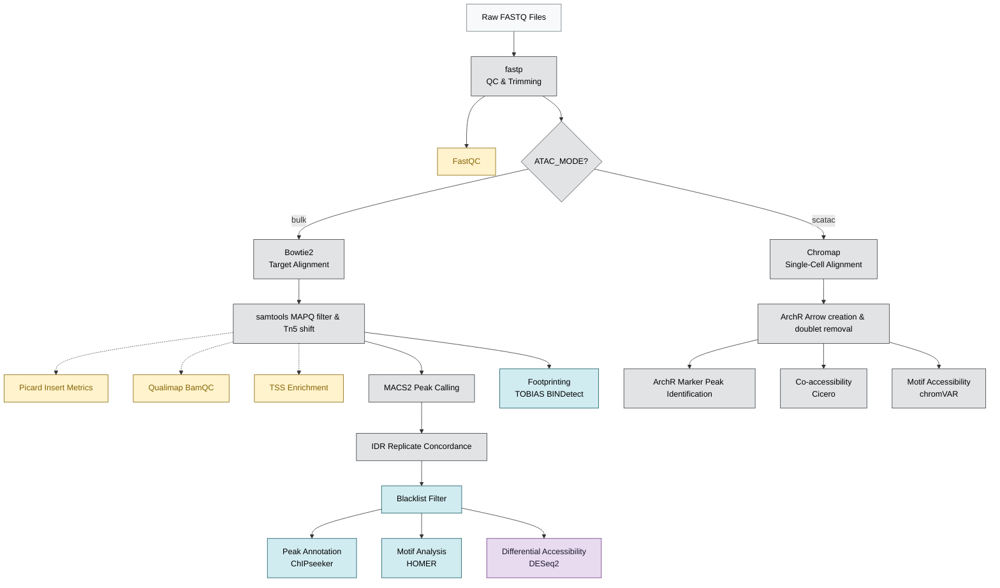

# BDB-Genomics ATAC-seq Pipeline

A production-grade, config-driven Snakemake framework for end-to-end chromatin accessibility analysis. 

Built for resilience, it supports both bulk and single-cell modalities, automatically scales from 4GB laptops to HPC clusters and Cloud instances, and implements strict Quality Control gating to halt poor samples before downstream processing.

---

## 🏗️ Pipeline Architecture



---

## 🚀 Quick Start

The pipeline relies on **Snakemake 8.0+** and uses a wrapper script to bootstrap execution seamlessly.

### 1. Configure the Run
Edit `config.yaml` to specify your parameters and ensure your metadata is in `data/samples.tsv`.

### 2. Execute
Run the pipeline using the wrapper script, which handles environment detection, pre-flight validation, and execution profiles automatically:

```bash
# Run locally using 8 cores
scripts/run_pipeline.sh -c 8 -- --profile profiles/local

# Run on an HPC cluster using SLURM
scripts/run_pipeline.sh -- --profile profiles/slurm

# Run in the Cloud (e.g., Google Cloud Batch)
scripts/run_pipeline.sh -- --profile profiles/gcp
```

---

## 📁 Repository Documentation Map

For detailed architectural information, please consult the specific `README.md` files located in each foundational directory:

| Directory | What you will find there |
|---|---|
| [`profiles/`](profiles/) | Cloud, SLURM, and local execution configuration profiles |
| [`scripts/`](scripts/) | Pipeline orchestration and execution wrappers |
| [`envs/`](envs/) | Grouped, multi-tool Conda environments for manual debugging |
| [`rules/envs/`](rules/envs/) | Strict, 1-to-1 modular Conda environments for automated rules |
| [`rules/`](rules/) | Modular `.smk` files and dependency flowcharts |
| [`AGENTS.md`](AGENTS.md) | Agent context for the Understand-Anything plugin and Open-Wiki integration |

---

## 🔒 Security & Fail-Safes

| Mechanism | Description |
|---|---|
| **Pre-flight Validation** | The `scripts/` wrapper enforces configuration validation *before* execution. |
| **Strict Isolation** | `rules/envs/` guarantees completely isolated tool executions. |
| **Defensive Analytics** | R and Python scripts gracefully write placeholder outputs instead of crashing when biological data yields 0 peaks/overlaps. |
