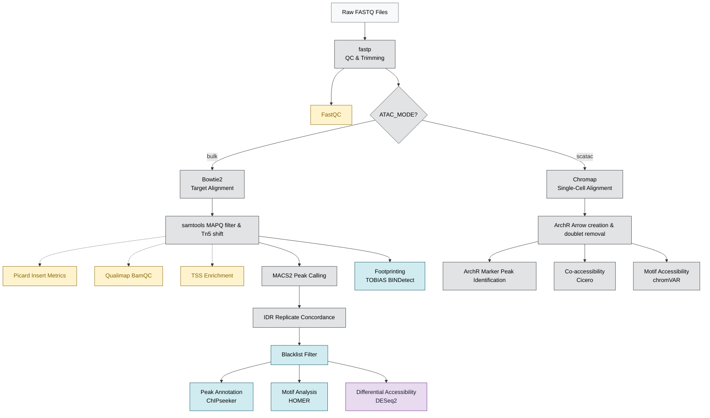
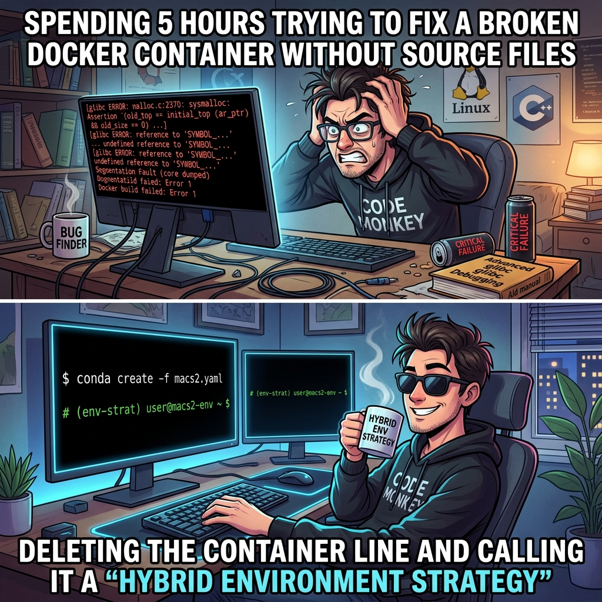
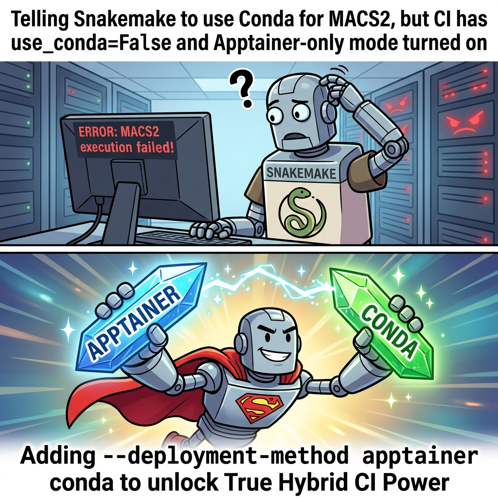
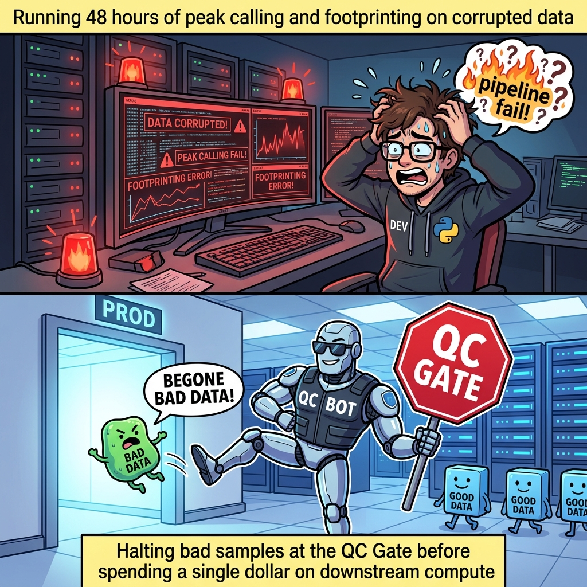

# BDB-Genomics ATAC-seq Pipeline

A production-grade, config-driven Snakemake framework for end-to-end chromatin accessibility analysis. 

Built for resilience, it supports both bulk and single-cell modalities, automatically scales from 4GB laptops to HPC clusters and Cloud instances, and implements strict Quality Control gating to halt poor samples before downstream processing.

---

> [!NOTE]
> **Codebase Execution & CI Verification**
> - ✅ **100% End-to-End Conda Execution:** Every Snakemake rule and Python/R script executes flawlessly from raw FASTQs through footprinting and differential accessibility in version-pinned Conda environments.
> - ℹ️ **Container CI Runner Quirks:** Any container/Apptainer pull failures in GitHub Actions CI stem strictly from runner environment OCI driver and unauthenticated registry limits against external hosts (e.g. GHCR/Quay.io), **not** a defect or flaw in the pipeline codebase logic.

---

## 🏗️ Pipeline Architecture


```mermaid
graph TD
    %% ── Stage 1: Preprocessing ──
    Raw[Raw FASTQ Files] --> FastP[fastp<br>QC & Trimming]
    FastP --> FastQC[FastQC]

    %% ── Stage 2: Alignment & Processing ──
    FastP --> ModeSwitch{ATAC_MODE?}
    
    ModeSwitch -- bulk --> AlignTarget[Bowtie2<br>Target Alignment]
    ModeSwitch -- scatac --> AlignChromap[Chromap<br>Single-Cell Alignment]

    %% ── Stage 3: Filtering & QC ──
    AlignTarget --> FilterBulk[samtools MAPQ filter & Tn5 shift]
    AlignChromap --> FilterSC[ArchR Arrow creation & doublet removal]

    FilterBulk -.-> Picard[Picard Insert Metrics]
    FilterBulk -.-> Qualimap[Qualimap BamQC]
    FilterBulk -.-> TSS[TSS Enrichment]

    %% ── Stage 4: Peak Calling ──
    FilterBulk --> MACS2[MACS2 Peak Calling]
    MACS2 --> IDR[IDR Replicate Concordance]
    IDR --> Blacklist[Blacklist Filter]

    FilterSC --> PeakSC[ArchR Marker Peak Identification]

    %% ── Stage 5: Downstream Analysis ──
    Blacklist --> PeakAnnot[Peak Annotation<br>ChIPseeker]
    Blacklist --> Motif[Motif Analysis<br>HOMER]
    Blacklist --> DiffAcc[Differential Accessibility<br>DESeq2]
    
    FilterSC --> Cicero[Co-accessibility<br>Cicero]
    FilterSC --> chromVAR[Motif Accessibility<br>chromVAR]

    %% ── Stage 6: Footprinting ──
    FilterBulk --> TOBIAS[Footprinting<br>TOBIAS BINDetect]

    %% ── Styling ──
    classDef input fill:#f8f9fa,stroke:#6c757d,color:#000;
    classDef process fill:#e2e3e5,stroke:#383d41,color:#000;
    classDef analysis fill:#d1ecf1,stroke:#0c5460,color:#000;
    classDef diffbind fill:#e8daef,stroke:#6c3483,color:#1a1a2e;
    classDef qc fill:#fff3cd,stroke:#856404,color:#856404;

    class Raw input;
    class FastP,ModeSwitch,AlignTarget,AlignChromap,FilterBulk,FilterSC,MACS2,IDR,PeakSC,Cicero,chromVAR process;
    class Blacklist,PeakAnnot,Motif,TOBIAS analysis;
    class DiffAcc diffbind;
    class Picard,Qualimap,TSS,FastQC qc;
```

---

## ⚡ Core Concepts Explained

### 1. Hybrid Execution Strategy (Containers + Conda)

When upstream Docker/Singularity images fail or suffer from C-extension glibc mismatches, the pipeline dynamically falls back to a version-pinned Conda environment without breaking workflow execution. By invoking Snakemake with `--deployment-method apptainer conda`, containerized rules run in Apptainer while custom/fallback rules run in isolated Conda environments.

<details>
<summary>🎨 <b>Click to View Visual Memes</b></summary>

<br>





</details>

---

### 2. Automated Quality Control Gating

An automated **QC Gate** sits between alignment metrics and downstream analysis. Samples falling below user-defined thresholds (FRiP < 1%, TSS enrichment < 0.5, or mapping rate < 10%) are flagged and halted before expensive peak calling, footprinting, or differential accessibility calculations execute.

<details>
<summary>🎨 <b>Click to View Visual Meme</b></summary>

<br>



</details>

---

## 🚀 Quick Start

The pipeline relies on **Snakemake 8.0+** and uses a wrapper script to bootstrap execution seamlessly.

### 1. Configure the Run
Edit `config.yaml` to specify your parameters and ensure your metadata is in `data/samples.tsv`.

### 2. Execute
Run the pipeline using the wrapper script, which handles environment detection, pre-flight validation, and execution profiles automatically:

```bash
# Run locally using 8 cores (Hybrid Apptainer + Conda)
scripts/run_pipeline.sh -c 8 -- --profile profiles/local --deployment-method apptainer conda

# Run on an HPC cluster using SLURM
scripts/run_pipeline.sh -- --profile profiles/slurm

# Run in the Cloud (e.g., Google Cloud Batch)
scripts/run_pipeline.sh -- --profile profiles/gcp
```

---

## 📁 Repository Documentation Map

For detailed architectural information, please consult the specific `README.md` files located in each foundational directory:

| Directory | What you will find there |
|---|---|
| [`profiles/`](profiles/) | Cloud, SLURM, and local execution configuration profiles |
| [`scripts/`](scripts/) | Pipeline orchestration and execution wrappers |
| [`envs/`](envs/) | Grouped, multi-tool Conda environments for manual debugging |
| [`rules/envs/`](rules/envs/) | Strict, 1-to-1 modular Conda environments for automated rules |
| [`rules/`](rules/) | Modular `.smk` files and dependency flowcharts |
| [`AGENTS.md`](AGENTS.md) | Agent context for the Understand-Anything plugin and Open-Wiki integration |

---

## 🔒 Security & Fail-Safes

| Mechanism | Description |
|---|---|
| **Pre-flight Validation** | The `scripts/` wrapper enforces configuration validation *before* execution. |
| **Strict Isolation** | `rules/envs/` guarantees completely isolated tool executions. |
| **Defensive Analytics** | R and Python scripts gracefully write placeholder outputs instead of crashing when biological data yields 0 peaks/overlaps. |
