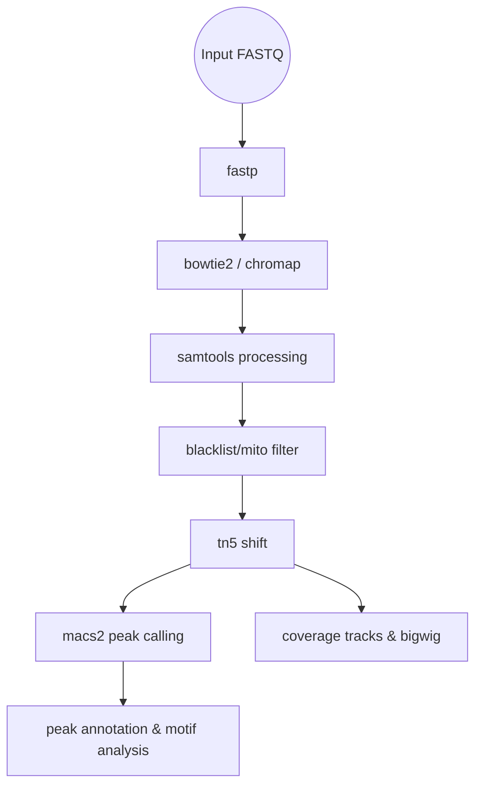

# Pipeline Rules (`.smk`)

This directory contains the modular Snakemake rule definitions that make up the ATAC-seq pipeline. Each `.smk` file encapsulates a specific bioinformatics tool or process, keeping the main `Snakefile` clean and maintainable.

---

## 🏗️ Architecture

The rules are designed to be entirely modular and self-contained. Below is the simplified dependency graph:

Every rule specifies its own:
- **Inputs and Outputs**: Dynamically resolved via `config.yaml`.
- **Resources**: Memory and time constraints for HPC scheduling.
- **Environment**: Tool-specific Conda definitions (found in `envs/`).
- **Telemetry**: Distinct log and benchmark outputs.

---

## 📁 Rule Categories

### 1. Preprocessing & Quality Control
| Rule File | Purpose |
|---|---|
| `fastp.smk` | Adapters trimming, quality filtering, and read truncation. |
| `fastqc.smk` | Raw read quality metrics generation. |
| `preseq.smk` | Library complexity estimation. |
| `qc_gate.smk` | Automated threshold validation (FRiP, TSS enrichment, alignment rates). Flags samples as PASS/FAIL. |
| `multiqc.smk` | Aggregation of all QC logs into a single HTML report. |
| `qualimap_bamqc.smk` | In-depth BAM quality control metrics. |
| `picard_*.smk` | Picard-based alignment and insert size metrics generation. |

### 2. Alignment & Processing
| Rule File | Purpose |
|---|---|
| `bowtie2.smk` / `chromap.smk` | Target genome alignment modes (Bowtie2 for standard, Chromap for fast/scalable mapping). |
| `samtools_*.smk` | BAM processing (sorting, filtering, mark duplicates, indexing, stats). |
| `remove_mito_reads.smk` | Filtration of mitochondrial reads to reduce background noise. |
| `blacklist_filter.smk` / `remove_blacklist_reads.smk` | Removal of reads falling into known artifactual genome regions. |
| `bedtools_genomecov.smk` / `bigwig.smk` | Coverage track computation and BigWig format conversion. |
| `tn5_shift.smk` | +4/-5 bp read shifting to account for Tn5 transposase binding offset. |
| `normalize_coverage.smk` | RPGC/CPM based coverage normalization. |

### 3. Peak Calling & Analytics
| Rule File | Purpose |
|---|---|
| `macs2_peak_calling.smk` | Core peak calling optimized for open chromatin. |
| `consensus_peaks.smk` | Merging replicates into a unified peak atlas. |
| `count_peaks.smk` | Generation of a consensus peak count matrix for differential analysis. |
| `peak_annotation.smk` | Genomic annotation of peaks (promoters, introns, intergenic) via ChIPseeker. |
| `differential_accessibility.smk` | DESeq2-based differential accessibility analysis between experimental groups. |
| `motif_analysis.smk` / `chromvar_analysis.smk` | Discovery and variability of enriched transcription factor motifs. |
| `heatmap.smk` | deepTools-based coverage heatmap generation centered on peaks/TSS. |
| `tss_enrichment.smk` | Computation of TSS enrichment profiles to validate library quality. |
| `cross_correlation.smk` | Strand cross-correlation metrics. |
| `idr.smk` | Irreproducible Discovery Rate calculation for true peak reproducibility. |
| `footprinting.smk` / `tobias.smk` | High-resolution transcription factor footprinting. |
| `archr.smk` / `cicero.smk` | Advanced single-cell / aggregate multi-omics compatibility frameworks. |

---

## 🔒 Best Practices Implemented

1. **Strict Error Handling**: All shell directives use `set -euo pipefail` to ensure tools fail fast on hidden errors.
2. **Deterministic Environments**: Every rule relies on a pinned Conda environment from `envs/`.
3. **Robust Templating**: Paths are never hardcoded; they are universally referenced from `config.yaml`.
4. **Log Redirection**: All `stderr` (`2>`) and `stdout` (`>`) are captured into rule-specific log files for telemetry parsing.
